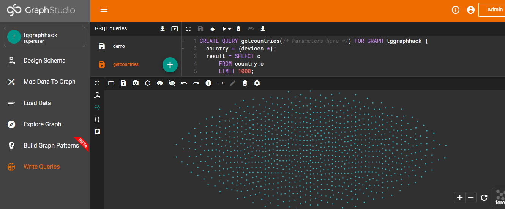

<h1>streamlit Data Analysis Application with Tigergraph, graphistry </h1
 

<h1 style="font-family: cursive; color: rgb(255, 127, 39)"><b><i>INTRODUCTION</i></b></h1>

    
In this project, Here, we are analyzing the <b>"<i>International Medical Devices Database</i>"</b> dataset.

    
It contains information on more than 120,000 Recalls, Safety Alerts and Field Safety Notices about medical devices distributed worldwide. The information connects with medical device companies and their subsidiaries.

    
Thus, We will be Exploring more than 120,000 Recalls, Safety Alerts and Field Safety Notices of medical devices and their connections with their manufacturers.

    <b>
    This application provides : 
        <ul>
            <li>Recall of manufacturers</li>
            <li>Safety Alert</li>
            <li>Field Safety Notice</li>
            <li>Product Classification</li>
            <li>Implanted device</li>
            <li>Quantity in Commerce</li>
            <li>Event Risk Class</li>
            <li>Local Authorities Determined Cause</li>
            <li>etc.</li>
        </ul>
    </b>
    
<b>Just use the menu on the left navigation bar to navigate throughout the application and explore the data</b>

<h3><b>Video Demo </b></h3>

<h1> To run the application </h1>

Follow the steps below : 

<ol>
	<li>
		Clone this project
	</li> 
	<li>
		install python :   <a href="https://www.python.org/downloads/" target="blank">See here</a>
	</li> 
	<li>
		install python virtual environment in the project location:   pip install virtualenv 
	</li> 
	<li>
		Activate the virtual envirenment:   venv/bin/activate.bat
	</li> 
	<li>
		Install the requirements:   pip install -r requirements.txt
	</li> 
	<li>
		Lunch the application:   streamlit run tigergraph.py
	</li> 
  	<li>
		Copy the link it generates from your console and past it in your navigator
	</li> 
</ol>

<h1 style="font-family: cursive; color: rgb(255, 127, 39)"><b><i>About</i></b></h1>

 
    In this project, we are using the <b> International Medical Devices Database's </b> dataset about the medical devices distribution statistics in the world.

    I developed it taking part in the TigerGraph Web-App hashton. And it has been an adventure full of learning

I used many technologies :
<ul>
    <li>python ; </li>
    <li>Streamlit ; </li>
    <li>tgcloud ; </li>
    <li>GrapgSql ; </li>
    <li>graphistry ; </li>
    <li>and many other libraries. </li>
</ul>

<h3 style="font-family: cursive; color: rgb(255, 127, 39)"><b>Why did I chose this dataset ?</b></h3>

I chosed to work on this dataset because it refers to medical domain. Since more than one year, the world is facing a lot of pression, so a such a system can analyse the repartition of medical devices in the countries, and determine the ones that do not have enough and put on strategies to provide them

    We can therefore visualize the data and identify the inequal repartition of this phenomene in countries and also, we can understand the differences depending on the age of the victims and through years

<h3 style="font-family: cursive; color: rgb(255, 127, 39)"><b>What did I do ?</b></h3>

    
So, what I have been doing is, saving the data in the tgcloud.io cloud database, and use the GSgl queries to retrieve the data that I wanted to manipulate in the streamlit application.

    
In addition, I also discovered the technology "graphistry" with its library (graphistry), which allowed me to make professional graphs and superb data visualization.

    
Finally, I was able to work with the python libraries also to have an appreciable interface and a multi-pages application

    <b>N.B. </b> It was my first time to work with TigerGraph and I discoverd a very great and powerfull technology that I can no longer do without. 
    <b style="color: orange">I literally fell in love with this technology</b>
    

<h1><b><i>GALLERY</i></b></h1>

	

		
		<small>Shemas from TigerGraph</small>
	

	<h1></h1>
	

		
		<small>Graph Explorer from TigerGraph cloud</small>
	

	

		
		<small>Data maping  from TigerGraph cloud</small>
	

	

		
		<small>Query example from TigerGraph cloud</small>
	

	

		
		<small>Graphistory platform</small>
	

